# "吃点啥" 校园餐饮平台 — UML 图表设计

---

## 一、用例图（Use Case Diagram）

### 1.1 学生用户用例图

```mermaid
graph LR
    Student((("学生用户")))

    subgraph 认证模块
        UC1[微信登录]
        UC2[修改密码]
        UC3[刷新Token]
        UC4[登出]
    end

    subgraph 用户模块
        UC5[查看个人信息]
        UC6[更新个人信息]
        UC7[设置偏好]
    end

    subgraph 浏览模块
        UC8[浏览商业区]
        UC9[浏览店铺]
        UC10[浏览菜品]
        UC11[搜索菜品]
        UC12[查看菜品详情]
        UC13[查看排行榜]
    end

    subgraph 互动模块
        UC14[发表评价]
        UC15[点赞评价]
        UC16[收藏菜品/帖子]
        UC17[取消收藏]
        UC18[添加想吃清单]
        UC19[标记已吃]
        UC20[提交反馈]
    end

    subgraph 帖子模块
        UC21[发布帖子]
        UC22[浏览帖子]
        UC23[点赞帖子]
        UC24[删除我的帖子]
    end

    subgraph 抽奖模块
        UC25[随机抽奖]
        UC26[条件抽奖]
        UC27[从收藏中抽奖]
        UC28[查看抽奖历史]
    end

    subgraph 商家入驻
        UC29[提交入驻申请]
    end

    subgraph 小法庭
        UC30[发起庭审]
        UC31[参与投票]
        UC32[查看庭审大厅]
        UC33[查看我的庭审]
    end

    Student --> UC1
    Student --> UC2
    Student --> UC3
    Student --> UC4
    Student --> UC5
    Student --> UC6
    Student --> UC7
    Student --> UC8
    Student --> UC9
    Student --> UC10
    Student --> UC11
    Student --> UC12
    Student --> UC13
    Student --> UC14
    Student --> UC15
    Student --> UC16
    Student --> UC17
    Student --> UC18
    Student --> UC19
    Student --> UC20
    Student --> UC21
    Student --> UC22
    Student --> UC23
    Student --> UC24
    Student --> UC25
    Student --> UC26
    Student --> UC27
    Student --> UC28
    Student --> UC29
    Student --> UC30
    Student --> UC31
    Student --> UC32
    Student --> UC33
```

---

### 1.2 商家用户用例图

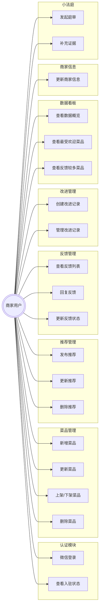

---

### 1.3 管理员用例图

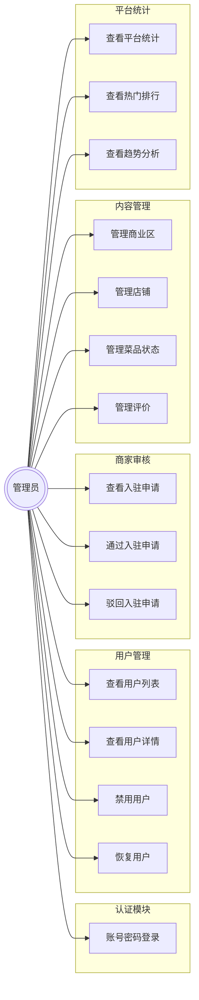

---

### 1.4 完整系统用例图（总览）

```mermaid
graph TB
    Student((("学生")))
    Merchant((("商家")))
    Admin((("管理员")))

    subgraph 认证与用户
        L1[微信登录]
        L2[账号密码登录]
        L3[修改密码]
        L4[个人信息管理]
        L5[偏好设置]
    end

    subgraph 商业区与店铺
        B1[浏览商业区]
        B2[浏览店铺]
        B3[管理商业区]
        B4[管理店铺]
    end

    subgraph 商家管理
        MGT1[商家入驻申请]
        MGT2[入驻审核]
        MGT3[商家信息管理]
        MGT4[数据看板]
    end

    subgraph 菜品管理
        D1[浏览/搜索菜品]
        D2[查看菜品详情]
        D3[管理菜品]
        D4[菜品状态管理]
        D5[发布推荐]
    end

    subgraph 互动与评价
        I1[发表评价]
        I2[点赞评价]
        I3[收藏]
        I4[想吃清单]
        I5[提交反馈]
        I6[回复反馈]
    end

    subgraph 学生帖子
        P1[发布帖子]
        P2[浏览帖子]
        P3[点赞帖子]
    end

    subgraph 抽奖系统
        LK1[抽奖]
        LK2[查看抽奖历史]
    end

    subgraph 排行榜
        R1[查看排行榜]
    end

    subgraph 小法庭
        CT1[发起庭审]
        CT2[参与投票]
        CT3[庭审大厅]
    end

    subgraph 管理员功能
        AD1[用户管理]
        AD2[内容管理]
        AD3[平台统计]
    end

    Student --> L1
    Student --> L3
    Student --> L4
    Student --> L5
    Student --> B1
    Student --> B2
    Student --> MGT1
    Student --> D1
    Student --> D2
    Student --> I1
    Student --> I2
    Student --> I3
    Student --> I4
    Student --> I5
    Student --> P1
    Student --> P2
    Student --> P3
    Student --> LK1
    Student --> LK2
    Student --> R1
    Student --> CT1
    Student --> CT2
    Student --> CT3

    Merchant --> L1
    Merchant --> MGT3
    Merchant --> MGT4
    Merchant --> D3
    Merchant --> D5
    Merchant --> I6
    Merchant --> CT1

    Admin --> L2
    Admin --> MGT2
    Admin --> B3
    Admin --> B4
    Admin --> D4
    Admin --> AD1
    Admin --> AD2
    Admin --> AD3
```

---

## 二、活动图（Activity Diagram）

### 2.1 学生微信登录活动图

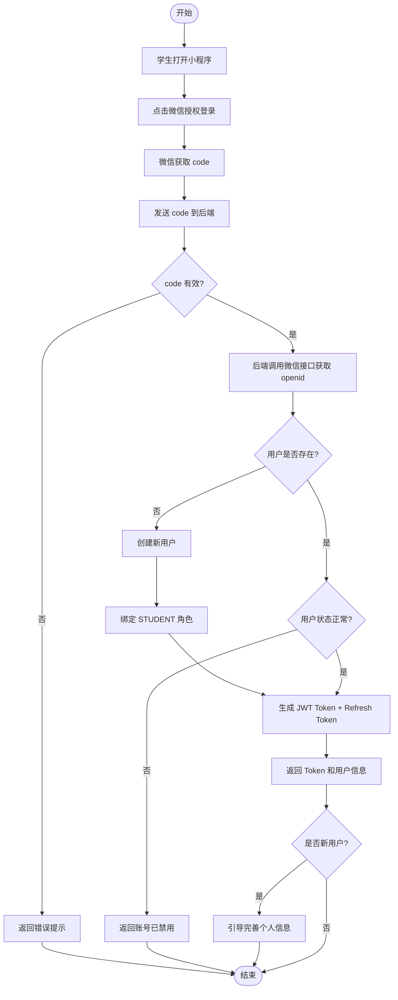

---

### 2.2 商家入驻申请活动图

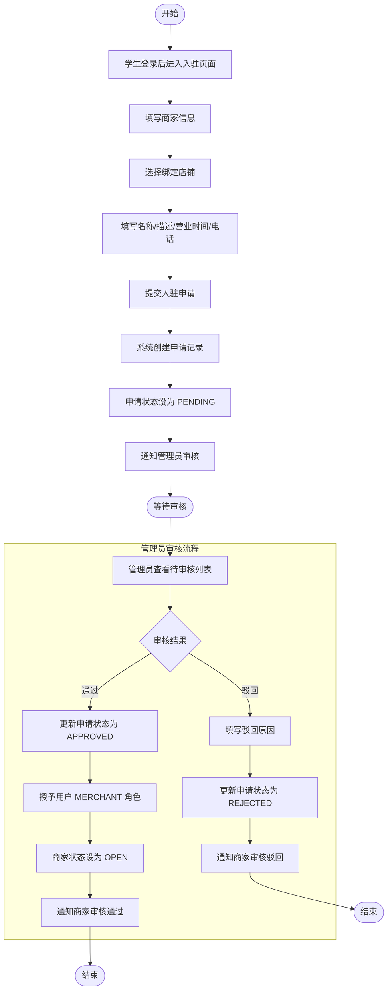

---

### 2.3 菜品浏览与评价活动图

```mermaid
flowchart TD
    Start([开始]) --> A[学生进入菜品列表页]
    A --> B{选择筛选条件}
    B --> C[按商业区筛选]
    B --> D[按分类筛选]
    B --> E[按标签筛选]
    B --> F[按价格范围筛选]
    B --> G[关键词搜索]
    C --> H[查询菜品列表]
    D --> H
    E --> H
    F --> H
    G --> H
    H --> I[展示菜品列表]
    I --> J[学生点击菜品]
    J --> K[查看菜品详情]
    K --> L[浏览量 +1]
    L --> M{学生操作}

    M -- 收藏 --> N[添加收藏记录]
    N --> O[菜品收藏数 +1]
    O --> M

    M -- 加入想吃 --> P[添加到想吃清单]
    P --> M

    M -- 发表评价 --> Q[填写评分]
    Q --> R[填写口味/分量/性价比评分]
    R --> S[填写评价文字]
    S --> T{上传图片?}
    T -- 是 --> U[上传评价图片]
    U --> V[提交评价]
    T -- 否 --> V
    V --> W[创建评价记录]
    W --> X[更新菜品平均评分]
    X --> Y[更新商家平均评分]
    Y --> M

    M -- 提交反馈 --> Z[选择反馈类型]
    Z --> AA[填写反馈内容]
    AA --> AB[创建反馈记录]
    AB --> M

    M -- 返回 --> AC([结束])
```

---

### 2.4 抽奖活动图

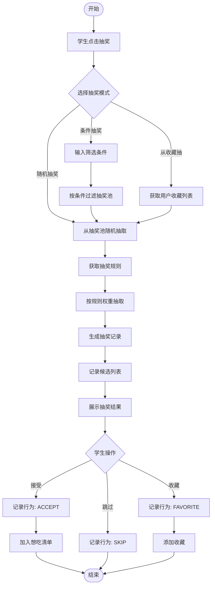

---

### 2.5 反馈处理活动图

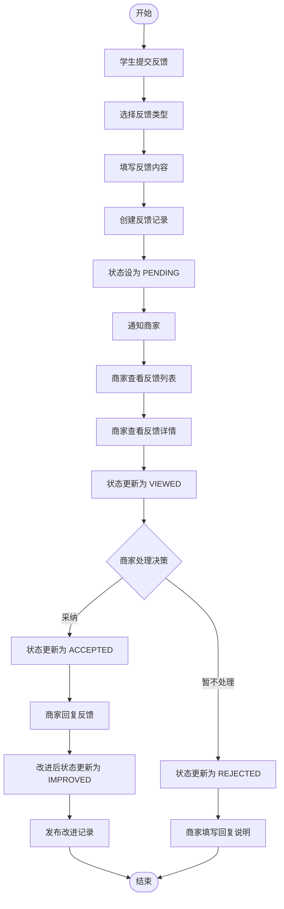

---

### 2.6 小法庭庭审活动图

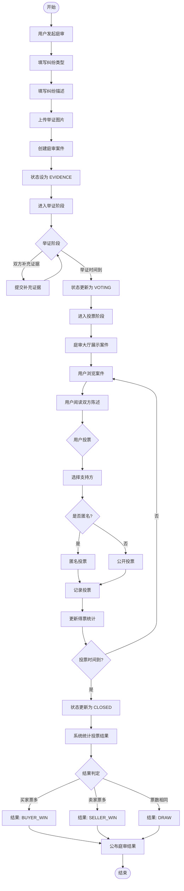

---

### 2.7 商家菜品管理活动图

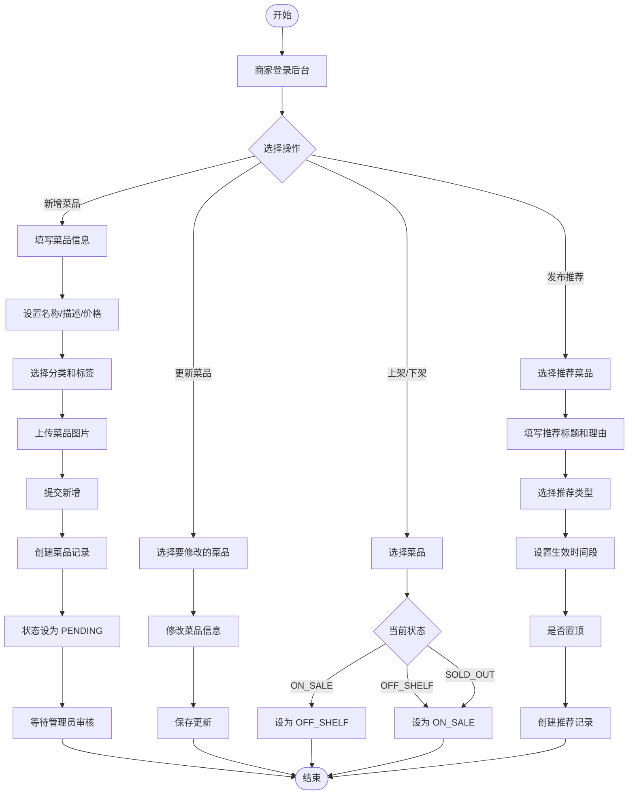

---

### 2.8 管理员审核与管理活动图

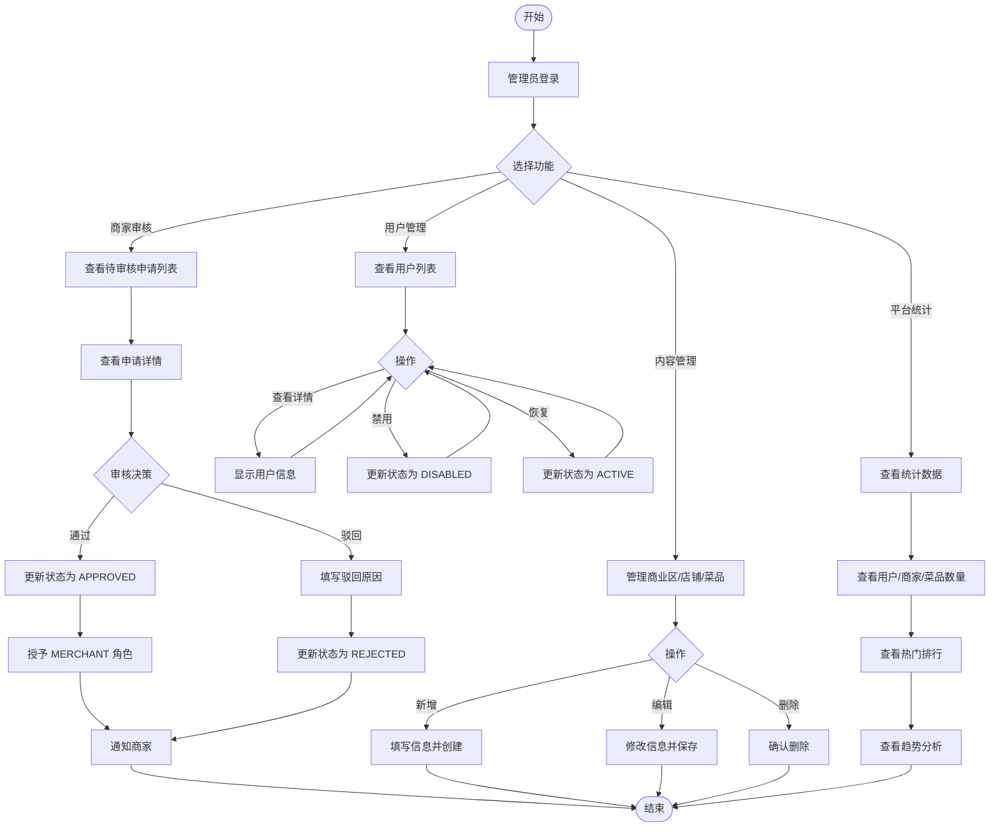

---

### 2.9 学生发布帖子活动图

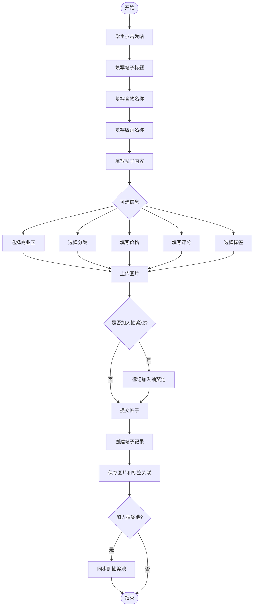

---

### 2.10 想吃清单活动图

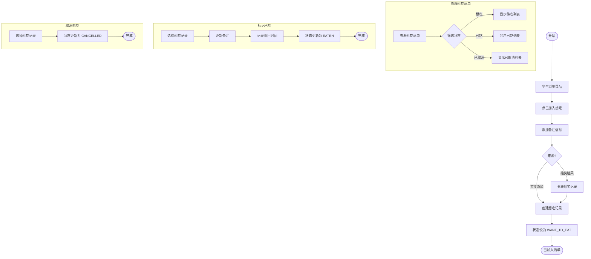

---

## 三、图表说明

### 3.1 用例图说明

| 角色 | 用例数量 | 核心功能 |
|------|----------|----------|
| 学生用户 | 33 | 登录、浏览、评价、收藏、抽奖、发帖、小法庭 |
| 商家用户 | 20 | 菜品管理、推荐管理、反馈处理、数据看板、小法庭 |
| 管理员 | 15 | 用户管理、商家审核、内容管理、平台统计 |

### 3.2 活动图说明

| 活动图 | 描述 |
|--------|------|
| 学生微信登录 | 完整的微信授权登录流程，含新用户判断 |
| 商家入驻申请 | 从提交申请到管理员审核的完整流程 |
| 菜品浏览与评价 | 学生浏览、收藏、评价、反馈的一体化流程 |
| 抽奖活动 | 三种抽奖模式及结果处理流程 |
| 反馈处理 | 学生提交到商家处理的完整闭环 |
| 小法庭庭审 | 举证、投票、判决的完整庭审流程 |
| 商家菜品管理 | 菜品增删改查和推荐发布流程 |
| 管理员审核与管理 | 管理员日常审核和管理操作流程 |
| 学生发布帖子 | 帖子创建和抽奖池同步流程 |
| 想吃清单 | 想吃清单的增删改查流程 |
